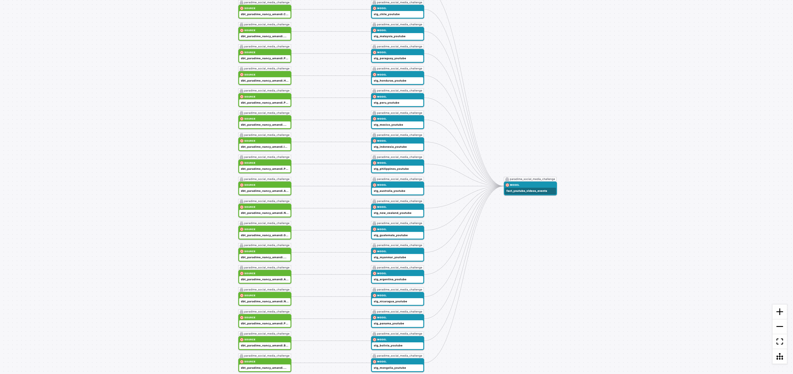
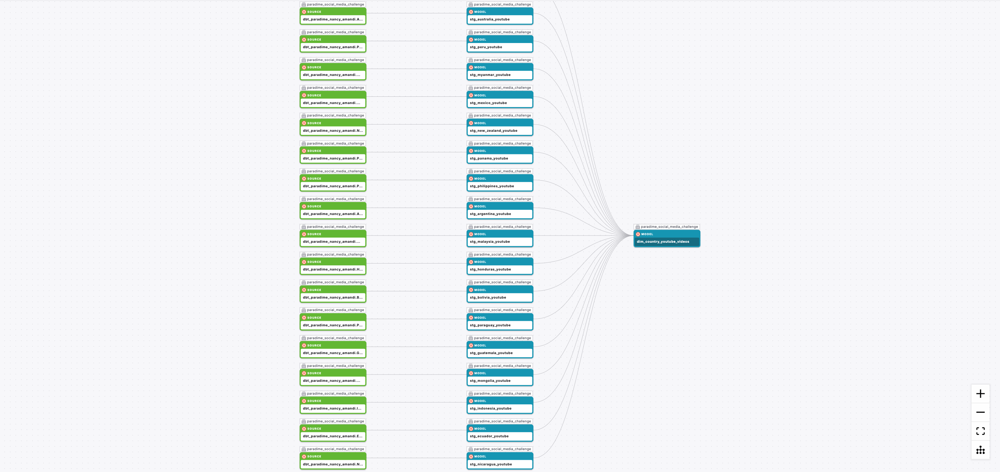
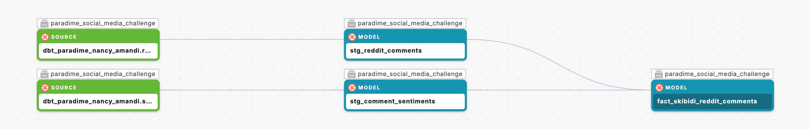

# dbt™ Data Modeling Challenge - Social Media Edition

Welcome to the [dbt™ Data Modeling Challenge - Social Media Edition](https://www.paradime.io/dbt-data-modeling-challenge)! This challenge showcases my data modeling skills using social media data.

## 📋 Table of Contents

1. [Introduction](#introduction)
2. [Data Sources](#data-sources)
   - [Data Lineage](#data-lineage)
3. [Methodology](#methodology)
   - [Tools Used](#tools-used)
   - [Data Preparation Techniques](#data-preparation-techniques)
4. [Insights](#insights)
   - [Youtube Stands Out](#youtube-stands-out)
   - [Definitely Not Technology](#definitely-not-technology)
   - [Newbie on the Trend Table](#newbie-on-the-trend-table)
   - [Songs? Really?](#songs-really)
   - [Songs it is!](#songs-it-is)
   - [More Popularity in the North and South](#more-popularity-in-the-north-and-south)
   - [The South Still Has It](#the-south-still-has-it)
   - [Entertainment Comes Top](#entertainment-comes-top)
   - [It's at Top 5](#its-at-top-5)
   - [Non-Youtube Engagements are also High](#non-youtube-engagements-are-also-high)
   - [Sentiments Went on a Dip](#sentiments-went-on-a-dip)
   - [Skibidi Toilet is for the New Generation](#skibidi-toilet-is-for-the-new-generation)
5. [Conclusions](#conclusions)
6. [Recommendations](#recommendations)

## Introduction

- How do people get upto 1M views on their youtube channels?

- How can I have a youtube channel that could fetch thousands of dollars?

- Why is my youtube channel subscribers not running into hundreds of thousands of subscribers?

If you've had questions like these on your mind, then we might be on the same page? Whether you're thinking of having a youtube channel or already have a youtube channel that's stuck on low views, low subscribers and low engagement in general, this analysis could change your perspective about the usual youtube channel and move you to having an unusual youtube channel (one with millions of engagements). So how about we dig in and get into the analysis right away...

## Data Sources

My analysis was based on data sources from Paradime and other sources.

The Paradime data source includes the hackernews data provided in the competition.

Additional Data Sources:

- [Youtube Data API](https://developers.google.com/youtube/v3) where data metrics from different youtube channels across different countries were extracted. Thanks to [@Mithelljy](https://github.com/mitchelljy) for his [Trending Youtube Scraper Python Script](https://github.com/mitchelljy/Trending-YouTube-Scraper/blob/master/scraper.py)

- [Google Trends Data](https://trends.google.com/trends/)

- [Python Reddit API Wrapper](https://praw.readthedocs.io/en/stable/) where reddit data was extracted using my python script. This python script also did some sentiment analysis on the comments and posts extracted based on my specific keyword.

### Data Lineage

Listed below is the data lineage for some of the models:

## Methodology

### Tools Used:

- [Paradime](https://www.paradime.io/) for SQL, dbt modeling

- [Hex](https://hex.tech/) for data visualization

- [Motherduck](https://motherduck.com/) for data storage

- Python for data extraction and sentiment analysis

- Microsoft Excel to transform data gotten from Google Trends before moving them into Motherduck

### Data Preparation Techniques

- Selected distinct values in various data sources pulled into Motherduck to prevent duplicate values

- Use of dbt tests to test for uniqueness and desired relationships between tables

- Ensured structured header layout of csv files gotten from Google Trends

- Merged the different countries youtube data extracted from the Youtube data api into one table using dbt while using a 'country' flag column to distinguish the data coming from different countries

- Carried out sentiment analysis on reddit posts and comments using python

- converted columns into their respective data types to aid analysis

## Insights

To have a more interactive dive into my insights, you can visit [my Hex App](https://app.hex.tech/e6c00971-5b65-4681-a8cb-b90ada70d712/app/da170203-740a-4676-8f76-467ac4e5ed64/latest).

## How Skibidi Toilet Flushed Its Way to Youtube Fame

*Get insights from this project on how an animation came from nowhere to steal the show on Youtube. Insights derived from this project can help you own your fame on Youtube.*

### Youtube Stands Out

Of the most used platforms on Hackernews, Youtube stands out as one of the top after Github. For a place such as Hackernews for people in Technology and Entrepreneurship, it's no surprise that Github came at the top. 

It's also not a surprise that Youtube came second because Youtube has been known to be one of the most used learning resources especially for those who are into technology.

However, in general terms, what Youtube search queries have been trending between 2021 and now? **Would these Youtube search queries still be in the domain of technology?**

### Definitely Not Technology

'Skibidi toilet' has been on the trending tables since 2021. Do you know what 'skibidi toilet' is? Never heard of the term before? I'll enlighten you.

Here's a brief on 'skibidi toilet' by Wikipedia:
> Skibidi Toilet is a machinima web series released through YouTube videos and shorts, created by Alexey Gerasimov and uploaded on his YouTube channel DaFuq!?Boom!. Produced using Source Filmmaker, the series follows a fictional war between human-headed toilets and humanoid characters with electronic devices for heads.

**What do you think about this term in comparison to others on the trend table?** Has 'skibidi toilet' been existing for a long time? Or did it just get introduced into the world?

### Newbie on the Trend Table

'Skibidi toilet' was first posted on Youtube in February 2023. But it started trending few weeks after it was posted. Although the trending skibidi toilet seems to have reduced in popularity over time, skibidi toilet still stays at the top in comparison to the other trending queries.

**To delve deeper into it, what terms are people searching for that has made it trending since it was posted on Youtube?**

### Songs? Really?

People are mostly searching for the songs in the series. Surprising? Probably not.

**But if skibidi songs were to be one of the top keywords, can we also claim that 'songs' in general terms are one of the most searched keywords on Youtube?**

## Songs it is!

Song seems to appear as one of the most searched formats on Youtube. Notice the huge gap between the song and movie that's the second top format. Also, it's plural form (Songs) also appeared at the top 4.

But who could be searching for songs on Youtube or even 'skibidi toilet songs'?

Have you seen this quote by MintTwist?

> One of biggest mistakes I see people making on Youtube creating videos that nobody is searching for?

If you want to make rival Youtube content, you need to understand your audience. And the owners of skibidi toilet definitely did. So what nationalities are more interested in this content?

### More Popularity in the North and South

For a more interactive map. Visit [this link](https://app.hex.tech/e6c00971-5b65-4681-a8cb-b90ada70d712/app/da170203-740a-4676-8f76-467ac4e5ed64/latest?selectedStaticCellId=7d782ae3-9c78-40ea-9310-9a57bd94b94b)

There's an obvious division of popularity of 'skibidi toilet' worldwide. There is more popularity in the North and South American countries compared to other countries. Skibidi toilet is also popular in Australia. 

**Going back to general terms, can we also say that there's simiilar popularity of Entertainment Youtube videos in these countries?**

### The South Still Has It

For a more interactive map, visit [this link](https://app.hex.tech/e6c00971-5b65-4681-a8cb-b90ada70d712/app/da170203-740a-4676-8f76-467ac4e5ed64/latest?selectedStaticCellId=0c51ca64-6da8-4de3-ae24-78b0b69b83ec)

Although there's insufficient data to make this conclusion, the South American countries are more interested in Entertainment Youtube videos compared to other countries. 

**Now, in comparision to other youtube video categories, what position do the Entertainment category fall on?**

### Entertainment Comes Top

In measuring the average views per video, the 'Entertainment' Category still comes top of all categories in Youtube. However, there's a little gap between the Entertainment and Science & Technology categories. 
Let's go back to being specific on 'Skibidi toilet', what is the growth of the youtube channel hosting the animation compared to other youtube channels?

### It's at Top 5

DaFuq!?Boom!, the youtube channel hosting the skibidi toilet animation is the 5th top channel based on average views per video. 

Let me show you a quick list of the channels and their first time videos:
- MrBeast - 12 years ago

- UNILAD - 6 years ago

- Meow-some! Reacts - October 2023

- Ben Azelart - 8 years ago

- DaFuq?!Boom! - 7 years ago

Asides 'Meow-some! Reacts' that is an exception,  DaFuq?!Boom! is doing well in comparison to other Youtube channels that are ahead of it. If it stays on track in creating engaging content for its audience, it could surpass some of these Youtube channels.

Onto our next question...

**Are these engagement stuck on Youtube? Or is skibidi toilet talked about well outside the walls of Youtube?**

### Non-Youtube Engagements are also High

Based on the scores below, there is high engagement of posts associated with 'skibidi toilet' on Reddit. the Reddit post score of 2873 and upvote ratio of 0.883 indicates that people have a general liking for the posts made about it. Hence, the higher number of upvotes compared to the downvotes. 

The comment score of 12 also shows that there are also decent number of engagements with the comments. 

However, there's a contradictory information with the sentiment score. It tends to be almost neutral as regards people's perspective about skibidi toilet. 

**Has this almost neutral sentiment been a constant thing? Or did it change at some point?**

### Sentiments Went on a Dip

There has been constant fluctuations of the sentiment towards skibidi toilet overtime. While the dips recovered most of time, it hasn't recovered since the dip in June 2024. It's possible that the videos are no longer meeting the expectations of the audience. But we can't say that for sure.

**How about the most used terms in these reddit posts? What do people mention when they discuss about skibidi toilet?**

### Skibidi Toilet is for the New Generation

A look at the most used keywords in the Reddit skibidi toilet posts shows something unique. Skibidi toilet most likely resonates with kids and the gen alpha (Not GenZ) people. This is probably expected because not many adults would be interested in watching human heads creating wars in a toilet. 

There's also another bold word, 'like'. That probably confirms it. **People who talk about it mostly like Skibidi Toilet.**

## Conclusion

- **Youtube's Role in Tech and Entertainment:** Youtube remains a critical platform for both learning and entertainment. While it’s no surprise that Github leads among Hackernews users, Youtube’s position as second highlights its dual nature as a platform used for both tech education and mainstream entertainment.

- **Shift in Youtube's Search Trends:** Youtube's trending content has increasingly shifted towards entertainment, with non-technical videos like Skibidi Toilet gaining significant popularity. This reflects a broader cultural shift, where entertainment-focused content now dominates the platform's search trends.

- **Dominance of Songs as a Content Format:** Songs and music-related content consistently rank among the top Youtube searches, revealing the platform's appeal as a music discovery and entertainment hub. This reaffirms that Youtube serves a wide audience beyond just instructional or educational content.

- **Regional Popularity of Entertainment Content:** 'Skibidi Toilet' and entertainment videos, in general, have gained significant traction in North and South American regions. This highlights a cultural divide in Youtube preferences, with entertainment being favored more in these regions compared to others.

- **Potential for Content Growth:** The DaFuq!?Boom! channel's success with 'Skibidi Toilet' indicates that content tailored toward a specific, niche audience (such as Gen Alpha) can rapidly grow and even challenge long-established Youtube channels. This shows the potential for rapid growth with the right content strategy.

- **Sentiment Decline:** Despite initial popularity, the sentiment towards 'Skibidi Toilet' has dipped in recent months, possibly signaling audience fatigue or changing expectations. It’s an important reminder that even viral content needs continual innovation to maintain its momentum.

## Recommendations

- **Capitalize on Music Trends:** Given that songs and music videos dominate Youtube searches, entertainment-related channels could explore incorporating music into their content strategies.

- **Target Regional Audiences with Entertainment:** Brands and content creators could leverage the popularity of entertainment content in North and South America by tailoring their content strategies to appeal more to these regions. This could include adapting formats, language, and cultural references. Also, brands could study their desired audiences to see the kind of youtube categories they are interested in.

- **Sustaining Engagement through Content Innovation:** For entertainment channels like DaFuq!?Boom!, maintaining momentum will require continual content innovation. Introducing new characters, storylines, or even integrating community-driven ideas could help revive and sustain audience interest.

- **Understanding Generational Preferences:** Recognizing that Skibidi Toilet resonates with Gen Alpha more than other age groups, creators targeting younger audiences should consider creating content that is humorous, quirky, and visually engaging to capture and hold their attention.

- **Monitor Sentiment and Respond Quickly:** It is crucial for content creators to monitor the sentiment around their videos and make adjustments quickly. For instance, engaging with audience feedback on platforms like Reddit can provide early signals of dissatisfaction, allowing creators to pivot or innovate in response.

