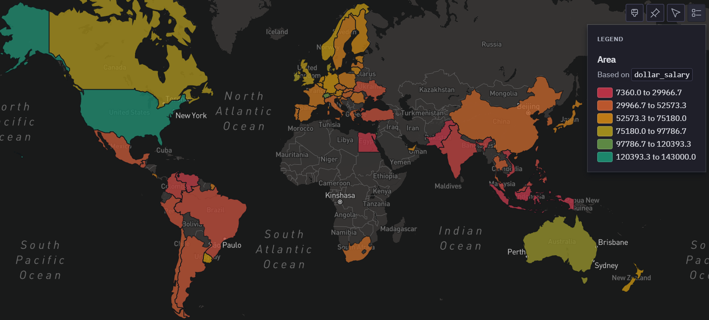
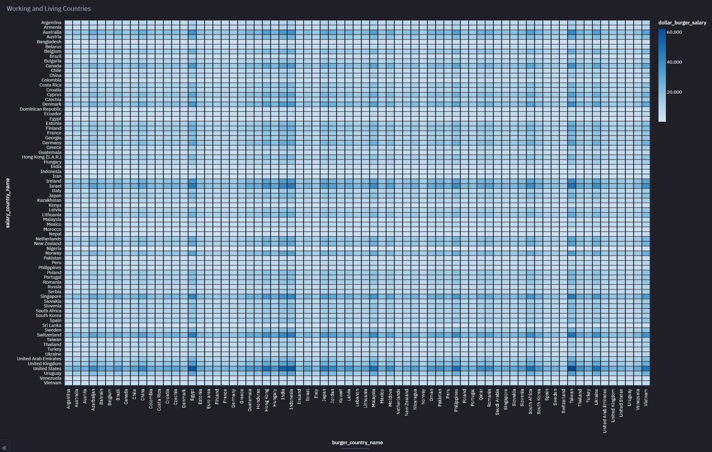

# Social Media Data Analysis - dbt™ Modeling Challenge

## Table of Contents
1. [Introduction](#introduction)
2. [Data Sources](#data-sources)
3. [Methodology](#methodology)
4. [Insights](#insights)
5. [Conclusions](#conclusions)

## Introduction
Goal: Combining Stack Overflow Salary Data with the Big Mac Index to Estimate Purchasing Power

In this analysis, the aim is to estimate the purchasing power of software developers by combining two distinct datasets: salary data from Stack Overflow’s developer survey and the Big Mac Index published by The Economist. The Stack Overflow survey provides detailed salary information for developers across various countries, while the Big Mac Index offers a measure of the relative cost of a Big Mac burger in different countries, serving as a proxy for purchasing power parity (PPP).

By integrating these datasets, one can calculate how many Big Macs a developer’s salary can buy in different countries. This approach allows to compare the real value of salaries globally, adjusting approximately for local cost of living. The resulting insights can help developers understand their relative earning potential and inform decisions about job opportunities and relocations.

## Data Sources
- Dataset 1 (*survey dataset*): Stack Overflow Developer Survey 2024 - A comprehensive survey that gathers insights from developers worldwide on various topics such as technology usage, work habits, salary and community trends. The data was supplied from the official Stack Overflow site: [The 2024 Developer Survey - Meta Stack Overflow](https://meta.stackoverflow.com/questions/430298/the-2024-developer-survey).
- Dataset 2 (*bigmac dataset*) : Big Mac Index July 2024 -  An informal measure of purchasing power parity (PPP) between different currencies, created by The Economist in 1986, which compares the price of a Big Mac burger in various countries to determine the relative value of currencies. The data was supplied from the official Github repository of The Economist:  [TheEconomist/big-mac-data: Data and methodology for the Big Mac index (github.com)](https://github.com/TheEconomist/big-mac-data)

### Data Lineage
Data lineage image:

## Methodology
### Tools Used
- Paradime: SQL and dbt™ development
- MotherDuck: Data storage and computing
- Hex: Data visualization

### Applied Techniques
- Data cleansing:
	- survey dataset: 
		- Two columns contain the salary data in the local currency "*CompTotal*" and "*ConvertedCompYearly*" in the dollar currency. The latter column contained empty values declared as "*NA*" that were removed. As statet in the methodology section the salaries from user currencies to USD were converted using the exchange rate on June 11, 2024 [Methodology | 2024 Stack Overflow Developer Survey](https://survey.stackoverflow.co/2024/methodology/#general).
	- bigmac dataset:
		- The data provided is cleaned and well formated. The most recent dataset range was selected for further analyses, which is from July 2024.
	- A total number of 58 countries with at least 20 responses are considered 
		- Where Guatemala has the lowest number of responses with 21 and the United States the largest numbre with 4,677 developers
- Key measures: 
	- In the aggregated data the median was used to compare the measured values, because in contrast to the average the median is not sensitive to outliers. 

## Insights

### Survey Salary 
- Salary distribution across countries

Not suprisingly the companies with the highes median paying salary of 143k USD are located in the United States. With some distance followed by Israel and Switzerland with approximately 110k USD.
At the low end of the scale there are Indonesia, Pakistan and Egypt with 7k to 9k USD per year. 

")

One can certanly argue that high income increases the purchasing power in general.  But what if a high income still only enables a mediocre state of life because of high cost of living. This insight cannot be extracted solely from the salary alone. For that other factors such as a price index has to be taken into account. 

Looking at geographical distribution of developer salaries one can identify clusters of high income reagions. 
Such as north america, europe and oceania. The regions in asia, africa, south america and the middle east show a lower median salary. 

### Big Mac Price
- Big Mac price distribution across countries:

	- The Big Mac Index is a simple informal way to measure the purchasing power parity (PPP) between different currencies. It was introduced by The Economist in 1986. 
	-	The Big Mac is chosen because it is a standardized product available in many countries, making it a good benchmark. The price of a Big Mac is compared across different countries. For example, if a Big Mac costs $5 in the US and £4 in the UK, the exchange rate implied by the Big Mac Index would be 1.25 ($5/£4). By comparing the local prices of Big Macs, the index helps to determine whether a currency is undervalued or overvalued relative to the US dollar.
	- It is an easy-to-understand way to compare the cost of living and the value of currencies. It highlights the differences in pricing and economic conditions across countries.
	- However, it doesn’t account for many factors that influence exchange rates, such as trade policies, market speculation, and economic conditions. The index is based on a single product, which may not represent the overall economy.

The highest price for a Big Mac is payed by customers in Switzerland with 8.1 USD. Followed  by Uruguay and Norway with about 7 USD. Taiwan, Indonesia, Egypt and India are at the low end of the scale with 2.3 to 2.7 USD. 

")

These prices provide us in our scenario a simle way to estimate the living costs and the purchasing power of a countries residents. Following this Switzerland would be the most expensive place wo live where Taiwan would be the cheapest. The question is now how many Big Mac burgers can a resident in these country afford assuming he works as a developer in that country with the countries medium salary?

In terms of living costs europa shows rather high prices. In asia, africa and the middle east are the lower prices can be found. 

### Purchasing Power for Salaries 
- The Big Mac Salary as a measure for purchasing power:
The basic idea is to adjust the nominal salary in each country by the Big Mac Index to get a sense of what that salary is really worth in terms of purchasing power.

    $$\text{Big Mac Salary} = \frac{\text{Survey Salary in USD}}{\text{Big Mac Price in USD}}$$

   The **Survey Salary** denotes the median salary for each country from the Stack Overflow survey in USD, that was converted from local currency by the data provider.
    The **Big Mac Price** acts as a measure of how expensive it is to live in each country. It typically provides the cost of a Big Mac converted in USD by the data provider.
   This measurement gives us the number of Big Macs that the nominal salary can buy. The higher this number, the more purchasing power the salary has.

- Example Calculation
Let’s consider a simplified example to illustrate the process:
	- *Country A (Switzerland):*
	  - Survey Salary: $111,417 USD/year
	  - Big Mac Price: $8.10 USD
	  - Big Mac Salary: $\frac{111,417}{8.1} = 13,755$ burgers/year
	  
	- *Country B (Canada):*
	  - Survey Salary: $87,231 USD/year
	  - Big Mac Price: $5.50 USD
	  - Big Mac Salary: $\frac{87,231}{5.5} = 15,860$ burgers/year

In this example, even though Switzerland has a higher nominal salary, the adjusted salary indicates that in terms of purchasing power (using the Big Mac as a proxy), Switzerland is not as advantageous as it might seem compared to Canada. This reflects the higher cost of living in Switzerland.

")

The hightest Big Mac Salaries i.e. number of Big Mac burgers a developer can afford with a median salary in a country are for Israel and the United States with roughly 25k burgers per year. Surprisingly, although Israel has a significantly lower median salaray compared to the US with a difference of about $\Delta$ 30k USD. Israel has also lower cost of living in terms of the Big Mac price of 4.5 USD compared to the US with 5.7 USD.
Switzerland on the other hand having the highes cost of living, where a resident developer can afford only 13.7k burger/year dispite having the third largest median salary.
Developers residing in Indonesia and Egypt have the one of the lowest median salaries but also one of the lowest cost of living, resulting in a purchasing power of 2.9k and 3.8k burgers/year, respectively.
Developers living and working in Venezuela and Pakistan have the lowest purchasing power of 2.1k and 2.2 burgers/year. Venezuela has a rather high Big Mac price of 5 USD, that is higher than tha of Israel. At the same time it has the fourth lowest median salary for developers with about 10.8k USD per year. 
Taiwan marks an noteable exception with 13.4k burgers/year. Having the lowest cost of living for resdent developers with a burger price of 2.3 USD and a median salary of about 30.8k USD/year developers may enjoy the purchasing power on the level of Switzerland. 

In terms of purchasing power the reagions norht america, europa and oceania are displaying high values in addition to east asia encompasing countries such as japan and china.

### Combine Work and Living Considerations

To determine the best combination of working in one country and living in another the following measure is introduced.

**Composite Score**:
	For each pair of work and live countries the potential purchasing power by considering how much of the work country’s salary could be spent in the living country:
	
  $$\text{Composite Score} = \frac{\text{Survey Salary in Work Country}}{\text{Big Mac Price in Live Country}}$$

  This score indicates how many Big Macs you could buy if you earned a salary in one country and lived in another, giving you a measure of the best work-live combination.

The best combination for this would be the United States as work country with a median salary of 143k USD and Taiwan the live country with the lowest cost of living measured by the Bif Mac price of 2.3 USD. 
Thus resulting in a purchasing power of 62k burgers per year, which is 2.5 times higher than in the United States. 

However, apart from the purchasing power other factors play a significant role for quality of live in a live country such as criminal rates, housing etc., which have not been considered in this study.

## Conclusions
High Salaries vs. Cost of Living: High nominal salaries do not always translate to high purchasing power due to varying costs of living.
Purchasing Power: Israel and the United States offer the highest purchasing power for developers, while Venezuela and Pakistan offer the lowest.
Optimal Work-Live Combination: The best scenario for maximizing purchasing power is earning a salary in the United States and living in Taiwan.
Additional Factors: Other quality-of-life factors, such as crime rates and housing, should also be considered when evaluating the best places to live and work.

By using this method, you as a digital nomad can better understand the real value of salaries across different countries and how to maximize your standard of living by considering both where you work and where you live.
